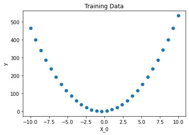
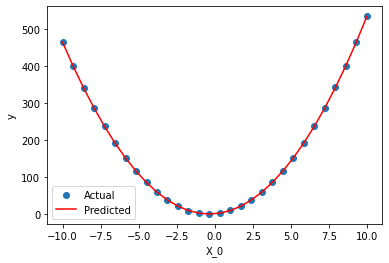

master: [](https://github.com/nasa/bingo/actions?query=branch%3Adevelop)
[](https://coveralls.io/github/nasa/bingo?branch=develop) 

develop: 
[](https://github.com/nasa/bingo/actions?query=branch%3Adevelop)
[](https://coveralls.io/github/nasa/bingo?branch=develop) 

## Description
Bingo is an open source package for performing symbolic regression, though it 
can be used as a general purpose evolutionary optimization package.  

## Key Features
*   Integrated local optimization strategies
*   Parallel island evolution strategy implemented with mpi4py
*   Coevolution of fitness predictors

# Quick Start

## Documentation
[Full Documentation Here](https://nasa.github.io/bingo/)

## Installation

To install Bingo, simply use pip.  Unfortunately the pip install is currently not working.  Please use source install for the time being.

```sh
pip install bingo-nasa
```

## Usage Example
A no-fuss way of using Bingo is by using the scikit-learn wrapper:
`SymbolicRegressor`. Let's setup a test case to show how it works.

### Setting Up the Regressor

There are many options that can be set in `SymbolicRegressor`. Here we set some basic ones including
`population_size` (the number of equations in a population), `stack_size` (the max number of nodes per equation), and `use_simplification`
(whether to use simplification to speed up equation evaluation and for easier reading). You can see all of `SymbolicRegressor`'s
options [here](https://nasa.github.io/bingo/_apidocs/bingo.symbolic_regression.html#module-bingo.symbolic_regression.symbolic_regressor).


```python
from bingo.symbolic_regression.symbolic_regressor import SymbolicRegressor
regressor = SymbolicRegressor(population_size=100, stack_size=16,
                              use_simplification=True)
```

    /home/gbomarit/Projects/Genetic_Programming/bingo/bingo/symbolic_regression/__init__.py:31: UserWarning: Could not load C++ modules No module named 'bingocpp.build.bingocpp'
      warnings.warn(f"Could not load C++ modules {import_err}")


### Training Data
Here we're just creating some dummy training data from the equation $5.0 X_0^2 + 3.5 X_0$. More on training data can be found
in the [data formatting guide](https://nasa.github.io/bingo/_high_level/data_formatting.html).
```python
import numpy as np
X_0 = np.linspace(-10, 10, num=30).reshape((-1, 1))
X = np.array(X_0)
y = 5.0 * X_0 ** 2 + 3.5 * X_0
```


```python
import matplotlib.pyplot as plt
plt.scatter(X, y)
plt.xlabel("X_0")
plt.ylabel("y")
plt.title("Training Data")
plt.show()
```


    

    


### Fitting the Regressor

Fitting is as simple as calling the `.fit()` method.


```python
regressor.fit(X, y)
```

    using 1 processes
     Generating a diverse population took 274 iterations.
    archipelago: <class 'bingo.evolutionary_optimizers.island.Island'>
    done with opt, best_ind: X_0 + (5.0)((0.49999999999999967)(X_0) + (X_0)(X_0)), fitness: 5.4391466376923e-28
    reran CLO, best_ind: X_0 + (5.0)((0.4999999999999999)(X_0) + (X_0)(X_0)), fitness: 5.352980018399097e-28


### Getting the Best Individual


```python
best_individual = regressor.get_best_individual()
print("best individual is:", best_individual)
```

    best individual is: X_0 + (5.0)((0.4999999999999999)(X_0) + (X_0)(X_0))


### Predicting Data with the Best Individual

You can use the regressor's `.predict(X)` or
the best_individual's `.evaluate_equation_at(X)` to get
its predictions for `X`.


```python
pred_y = regressor.predict(X)
pred_y = best_individual.evaluate_equation_at(X)

plt.scatter(X, y)
plt.plot(X, pred_y, 'r')
plt.xlabel("X_0")
plt.ylabel("y")
plt.legend(["Actual", "Predicted"])
plt.show()
```


    


# Source

## Installation from Source

For those looking to develop their own features in Bingo.

First clone the repo and move into the directory:

```sh
git clone --recurse-submodules https://github.com/nasa/bingo.git
cd bingo
```

Then make sure you have the requirements necessary to use Bingo:


```sh
conda env create -f conda_environment.yml
```

or

```sh
pip install -r requirements.txt
```

(Optional) Then build the c++ performance library BingoCpp:

```sh
./.build_bingocpp.sh
```

Now you should be good to go! You can run Bingo's test suite to make sure that
the installation process worked properly:

```sh
pytest tests
```

Add Bingo to your Python path to begin using it from other directories.

```sh
export PYTHONPATH="$PYTHONPATH:/path/to/bingo/"
```

and test it with:

```sh
python -c 'import bingo; import bingocpp'
```

## Contributing
1.  Fork it (<https://github.com/nasa/bingo/fork>)
2.  Create your feature branch (`git checkout -b feature/fooBar`)
3.  Commit your changes (`git commit -am 'Add some fooBar'`)
4.  Push to the branch (`git push origin feature/fooBar`)
5.  Create a new Pull Request

# Citing Bingo
Please consider citing the following reference when using bingo in your works.

### MLA:
Randall, David L., et al. "Bingo: a customizable framework for symbolic regression with genetic programming." Proceedings of the Genetic and Evolutionary Computation Conference Companion. 2022.

### Bibtex:
```latex
@inproceedings{randall2022bingo,
  title={Bingo: a customizable framework for symbolic regression with genetic programming},
  author={Randall, David L and Townsend, Tyler S and Hochhalter, Jacob D and Bomarito, Geoffrey F},
  booktitle={Proceedings of the Genetic and Evolutionary Computation Conference Companion},
  pages={2282--2288},
  year={2022}
}
```

# Versioning
We use [SemVer](http://semver.org/) for versioning. For the versions available, 
see the [tags on this repository](https://github.com/nasa/bingo/tags). 

# Authors
*   Geoffrey Bomarito
*   Tyler Townsend
*   Jacob Hochhalter
*   David Randall
*   Ethan Adams
*   Kathryn Esham
*   Diana Vera
  
# License 
Copyright 2018 United States Government as represented by the Administrator of 
the National Aeronautics and Space Administration. No copyright is claimed in 
the United States under Title 17, U.S. Code. All Other Rights Reserved.

The Bingo Mini-app framework is licensed under the Apache License, Version 2.0 
(the "License"); you may not use this application except in compliance with the 
License. You may obtain a copy of the License at 
http://www.apache.org/licenses/LICENSE-2.0 .

Unless required by applicable law or agreed to in writing, software distributed 
under the License is distributed on an "AS IS" BASIS, WITHOUT WARRANTIES OR 
CONDITIONS OF ANY KIND, either express or implied. See the License for the 
specific language governing permissions and limitations under the License.
