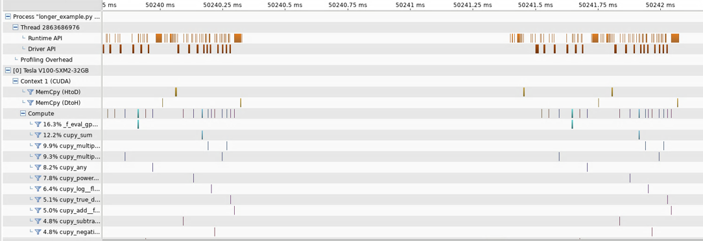
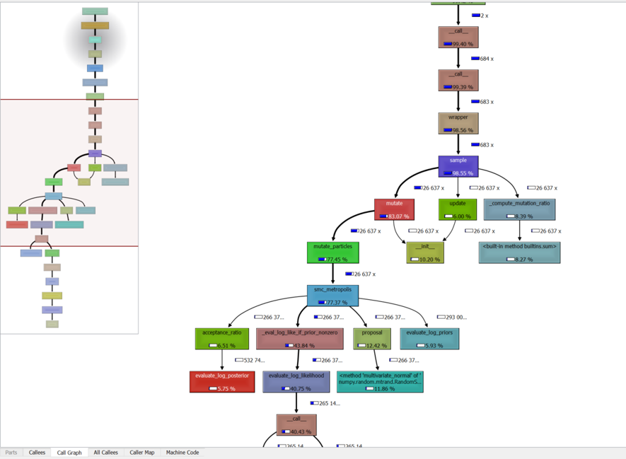

GPU/CPU Acceleration of Bingo and SMCPy
---------------------------------------

Code is located in two repositories:
* https://gitlab.larc.nasa.gov/bli6/bingo_gpu
* https://gitlab.larc.nasa.gov/bli6/smc_gpu

This project was aimed at speeding up Bingo and SMCPy using any means possible using GPU and CPU tools on the k-cluster. The `master` branch for both repos contains the code where both SMCPy and Bingo are on GPU. The `final-best-benchmarking` branch in SMCPy and the `current-best` branch in Bingo represent the fastest code throughout the project.

## Summary of Changes
Within both the current best and `master` branches, SMCBingo code to run examples was placed inside the Bingo repository. The example used for basic development and testing of SMCBingo code is located at `examples/longer_example.py`.

For the `master` branch, the goal was to put Bingo's evaluation code on GPU as well as any calls to SMCPy in SMCBingo, which involved putting the SMCSampler on the GPU. Data and the initial proposal are transferred onto GPU inside the BayesFitnessFunction in SMCBingo. All of SMCSampler performs the computation, and only the nmll value is transferred back to host. In the current best branches, the Bingo evaluation code and only the log-likelihood step in SMCPy are on GPU. This resulted in around a 30% speedup compared to vanilla SMCBingo, whereas the `master` branch code resulted in a slowdown.

In addition to the GPU additions, it was also possible to implement CPU parallelization of individual evaluation at the GP level in Bingo. This resulted in a factor of 20 speedup, and is included in both branches. There were also small optimizations done through small sections of SMCPy, such as removing calls to Python's default `any` and `sum` functions, which helped speed things up.

### Implementation Specifics
#### Bingo
* Bingo's evaluation was implemented by creating a custom kernel that bundles the entire evaluation. In doing so, we assume that the output dimensions are # of particles x # of data points. 
* A `global_imports` file was created to manage GPU imports so that any machine can still run Bingo without a GPU or the GPU libraries installed.
* The CPU parallelized evaluation does not update parameter values for each individual. This means that it cannot be used whenever such updates are necessary in the fitness computation.
* Data transfer was done initially in the BayesFitnessFunction in SMCBingo, which is now included as a part of Bingo
#### SMCPy
* Similar to Bingo, contains a `global_imports` file to manage GPU libraries
* GPU calls were implemented by replacing all NumPy calls with those of CuPy

## Attempted Changes
* Initially, Bingo's GPU evaluation was also implemented by replacing NumPy calls with CuPy. This was sucessfully implemented, but was found to be slower than using a custom kernel for the entire evaluation, likely due to synchronization issues.
* Naively putting GPU evaluation alone on GPU resulted in relatively insignificant speedup when considering the data transfer of results back to host. This was the motivation for putting the log-likelihood step in SMCPy on GPU.

## Profiling Tools
#### NVIDIA Tools
These tools are included with any of the Cuda modules available on K.
* `nvprof` - command line function useful for producing GPU function summaries and visual profiler outputs.
```
==128290== Profiling result:
            Type  Time(%)      Time     Calls       Avg       Min       Max  Name
 GPU activities:   16.07%  128.67ms     62812  2.0480us  1.9200us  13.344us  cupy_scan_naive
                    6.46%  51.705ms     31439  1.6440us  1.5680us  12.768us  cupy_bsum_shfl
                    6.11%  48.903ms     32384  1.5100us  1.4720us  2.7520us  [CUDA memcpy DtoH]
                    6.06%  48.498ms     15313  3.1670us  1.6960us  12.416us  cupy_sum
                    4.70%  37.661ms      7315  5.1480us  1.5680us  49.280us  cupy_any
                    4.63%  37.102ms     24821  1.4940us  1.2160us  12.704us  cupy_copy__float64_float64
                    4.24%  33.910ms     11161  3.0380us  1.2160us  44.096us  cupy_multiply__float64_float_float64
                    4.13%  33.086ms      3503  9.4450us  2.2080us  38.560us  _f_eval_gpu_kernel
```
* `nvvp` - opens up NVIDIA's visual profiler. Throughout the project, I used FastX on my local machine to open up the GUI using the installation on K. This is useful for identifying points of GPU usage, and potentially identifying where unexpected implicit data transfers occur.


#### CPU Tools
* `cProfile` - Python CPU profiling library, useful for generating call trees that illustrate where computation is taking place.

* QCacheGrind and `pyprof2calltree` - QCacheGrind is a GUI on Windows machines that views cProfile outputs. `pyprof2calltree` is a program that converts the output of cProfile into a readable format by QCacheGrind

## Notes for the Future
* Developing in three different repositories was somewhat cumbersome, it may have been best to create an overhead repository with all three (Bingo, SMCPy, SMCBingo) at the very beginning to better organize the code.
* Even with using the GPU flags provided by the code, if the user wants to use GPU, they must explicitly `import cupy` in their main function. Not doing this results in a CUDADriverError on the K-cluster.